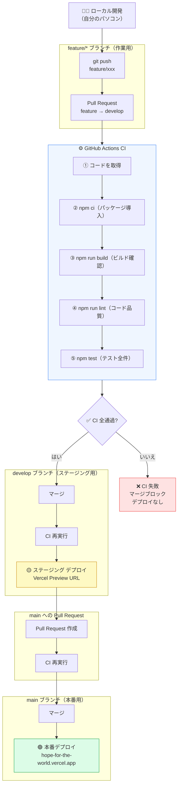
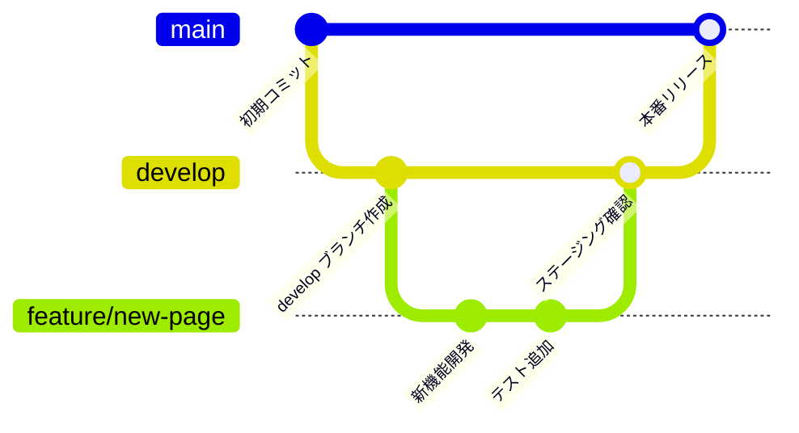

# CI/CD 設計概要 — Hope for the World

## 目次

1. [全体フロー図](#1-全体フロー図)
2. [ブランチ戦略](#2-ブランチ戦略)
3. [各ステップの説明](#3-各ステップの説明)
4. [現状の整理](#4-現状の整理)
5. [GitHub Secrets の設定方法](#5-github-secrets-の設定方法)
6. [今後追加すべきこと](#6-今後追加すべきこと)

---

## 1. 全体フロー図

> **CI（継続的インテグレーション）**: コードをプッシュするたびに自動でテスト・チェックを実行する仕組み  
> **CD（継続的デリバリー）**: テストが通ったら自動で本番サーバーに反映する仕組み



---

## 2. ブランチ戦略



### ブランチの役割

| ブランチ | 環境 | URL | 用途 |
|---------|------|-----|------|
| `feature/*` | なし | なし | 新機能・修正の作業ブランチ |
| `develop` | ステージング | Vercel Preview URL | 本番前の動作確認 |
| `main` | 本番 | hope-for-the-world.vercel.app | ユーザーが閲覧する本番環境 |

### 作業の流れ

```
1. main から feature ブランチを作成
   git checkout main
   git checkout -b feature/xxx

2. 開発・コミット

3. feature → develop に Pull Request 作成
   → CI 自動実行（Build / Lint / Test）
   → CI 通過後にマージ
   → Vercel ステージングに自動デプロイ

4. ステージングで動作確認

5. develop → main に Pull Request 作成
   → CI 自動実行
   → CI 通過後にマージ
   → Vercel 本番に自動デプロイ
```

---

## 3. 各ステップの説明

### CI（`.github/workflows/ci.yml`）

CI は以下のタイミングで自動実行されます：
- `feature/*` → `develop` の Pull Request 時
- `feature/*` → `main` の Pull Request 時
- `develop` への push 時
- `main` への push 時

#### ① コードを取得（checkout）
GitHub からコードをダウンロードします。

#### ② パッケージをインストール（`npm ci`）
`package-lock.json` を元に全ライブラリを厳密にインストール。バージョンが完全固定されるため環境差異が起きません。

#### ③ ビルドチェック（`npm run build`）
TypeScript の型エラー・import エラー・ビルド失敗を検出します。

#### ④ Lint チェック（`npm run lint`）
ESLint でコード品質をチェックします。

#### ⑤ テスト実行（`npm test -- --run`）
Vitest で 78件のテストを全て実行します。

### CD（デプロイ）

| ジョブ名 | 実行条件 | デプロイ先 |
|---------|---------|---------|
| `deploy-staging` | CI 成功 + `develop` push | Vercel Preview（ステージング） |
| `deploy-production` | CI 成功 + `main` push | Vercel 本番 |

**CI が失敗した場合、どちらのデプロイも実行されません。**

---

## 4. 現状の整理

### ✅ できていること

| 項目 | 詳細 |
|------|------|
| CI — ビルド / Lint / テスト | 自動実行 |
| CI 失敗時のデプロイ停止 | `needs: ci` で依存。CI 失敗 → デプロイなし |
| ステージング環境 | `develop` ブランチ → Vercel Preview |
| 本番デプロイ | `main` ブランチ → Vercel 本番 |
| ブランチ戦略 | feature → develop → main |

### ⬜ 手動設定が必要（GitHub Secrets）

| Secret 名 | 内容 |
|-----------|------|
| `VERCEL_TOKEN` | Vercel で発行したトークン |
| `VERCEL_ORG_ID` | `team_FFhKUtp3p166KH2I4bA78tjr` |
| `VERCEL_PROJECT_ID` | `prj_NO3X9bw3Ur6FqapxjIB1iEHPhHWs` |

### ❌ 未実装

| 項目 | 解決策 |
|------|--------|
| カバレッジ必須化 | `npm run test:coverage` を CI に追加 |
| PR レビュー必須化 | GitHub Branch Protection Rules |
| セキュリティスキャン | `npm audit` を CI に追加 |

---

## 5. GitHub Secrets の設定方法

### Step 1 — Vercel トークンを発行

1. [vercel.com](https://vercel.com) にログイン
2. 右上のアイコン → **Settings → Tokens**
3. **Create Token** をクリック
4. 名前: `GitHub Actions`、スコープ: `Full Account`
5. トークンをコピー（一度しか表示されません）

### Step 2 — GitHub に Secrets を追加

1. GitHub リポジトリ → **Settings → Secrets and variables → Actions**
2. **New repository secret** から以下を3つ追加：

| Secret 名 | 値 |
|-----------|-----|
| `VERCEL_TOKEN` | Step 1 のトークン |
| `VERCEL_ORG_ID` | `team_FFhKUtp3p166KH2I4bA78tjr` |
| `VERCEL_PROJECT_ID` | `prj_NO3X9bw3Ur6FqapxjIB1iEHPhHWs` |

### Step 3 — Vercel の自動デプロイを無効化

1. Vercel ダッシュボード → Project → **Settings → Git**
2. **Ignored Build Step** に以下を入力して保存：
   ```
   exit 1
   ```
   これで Vercel の自動デプロイが止まり、GitHub Actions 経由のみでデプロイされます。

---

## 6. 今後追加すべきこと

### 優先度：高

```yaml
# カバレッジチェックを CI に追加
- name: カバレッジ付きテスト
  run: npm run test:coverage
```

```
# GitHub Branch Protection Rules（GitHubダッシュボードで設定）
Settings → Branches → Branch protection rules
  ✅ main と develop に適用
  ✅ Require status checks to pass（CI ジョブを指定）
  ✅ Require branches to be up to date before merging
```

### 優先度：中

```yaml
# セキュリティスキャン
- name: セキュリティチェック
  run: npm audit --audit-level=high
```

### 優先度：低

- **Dependabot**: 依存パッケージの自動更新 PR を毎週作成
- **Lighthouse CI**: パフォーマンス・アクセシビリティスコアを自動計測
