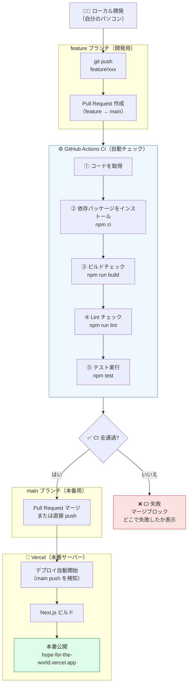
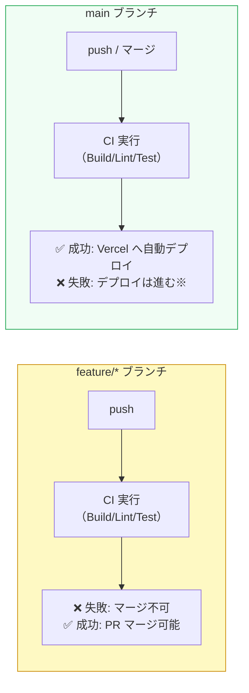

# CI/CD 設計概要 — Hope for the World

## 目次

1. [全体フロー図](#1-全体フロー図)
2. [システム概要](#2-システム概要)
3. [各ステップの説明](#3-各ステップの説明)
4. [現状の整理](#4-現状の整理)
5. [今後追加すべきこと](#5-今後追加すべきこと)

---

## 1. 全体フロー図

> **CI（継続的インテグレーション）**: コードをプッシュするたびに自動でテスト・チェックを実行する仕組み  
> **CD（継続的デリバリー）**: テストが通ったら自動で本番サーバーに反映する仕組み



### ブランチごとの動作の違い



> ※ 現在 Vercel は CI の結果に関係なくデプロイされます（後述の「未実装」参照）

---

## 2. システム概要

| 項目 | 内容 |
|------|------|
| ソースコード管理 | GitHub（`JesusandYutaka/Hope-for-the-World`） |
| CI ツール | GitHub Actions |
| CD ツール | Vercel（自動デプロイ） |
| 本番 URL | https://hope-for-the-world.vercel.app |
| 開発ブランチ | `feature/*` |
| 本番ブランチ | `main` |

---

## 3. 各ステップの説明

### CI（`.github/workflows/ci.yml`）

CI は `feature → main` の Pull Request 作成時と `main` への push 時に自動で動きます。

#### ① コードを取得（checkout）
GitHub のリポジトリからコードをダウンロードします。

#### ② 依存パッケージをインストール（`npm ci`）
`package-lock.json` を元に、全ライブラリを厳密にインストールします。  
`npm install` との違い：バージョンが完全に固定されるため、環境差異が起きません。

#### ③ ビルドチェック（`npm run build`）
Next.js の本番ビルドを実行します。  
以下の問題を検出できます：
- TypeScript の型エラー
- import パスの間違い
- 環境変数の参照エラー

#### ④ Lint チェック（`npm run lint`）
ESLint でコードの品質をチェックします。  
例：未使用の変数、`any` 型の使用、React のルール違反など。

#### ⑤ テスト実行（`npm test -- --run`）
Vitest で 78件のテストを全て実行します。  
対象：UI コンポーネント、ライブラリ関数、API ルートなど。

---

### CD（Vercel）

`main` ブランチへの push を Vercel が自動で検知し、以下を実行します：

1. `npm run build` を Vercel サーバーで実行
2. 静的ファイルと Server Component をビルド
3. Vercel のエッジネットワーク（世界中のサーバー）に配信
4. 本番 URL に反映

**ISR（インクリメンタル静的再生成）について:**  
ホームページは 24時間ごとに YouTube の最新動画を再取得します。  
それ以外のページはビルド時に静的ページとして生成されます。

---

## 4. 現状の整理

### ✅ できていること

| 項目 | 詳細 |
|------|------|
| CI — ビルドチェック | `npm run build` が自動実行される |
| CI — Lint チェック | `npm run lint` が自動実行される |
| CI — テスト | 78件のテストが自動実行される |
| CI — 実行タイミング | PR 作成時 / main push 時 |
| CD — 自動デプロイ | main push で Vercel が自動デプロイ |
| CD — 環境変数 | Vercel ダッシュボードで管理済み |

### ❌ 未実装・課題

| 項目 | 詳細 | 解決策 |
|------|------|--------|
| CI 失敗時のデプロイ停止 | 現在 CI が失敗しても Vercel はデプロイを続ける | Vercel Pro プランの「Require CI to pass」機能 |
| カバレッジチェック | テストカバレッジが基準以下でも通過してしまう | `npm run test:coverage` をCIに追加 |
| PR レビュー必須化 | レビューなしでもマージできる | GitHub の Branch Protection Rules で設定 |
| Staging 環境 | 本番前に確認できる環境がない | `staging` ブランチを作成し Vercel Preview と連携 |
| セキュリティスキャン | 脆弱性のある依存パッケージを自動検知する仕組みがない | `npm audit` をCIに追加 / GitHub Dependabot を有効化 |
| Lighthouse CI | パフォーマンス・アクセシビリティの自動計測がない | `lhci` をCIに追加 |

---

## 5. 今後追加すべきこと

### 優先度：高

```yaml
# 1. カバレッジチェックを CI に追加（ci.yml に追記）
- name: カバレッジ付きテスト
  run: npm run test:coverage
```

```
# 2. GitHub Branch Protection Rules の設定（GitHubダッシュボードで設定）
Settings → Branches → main → Require status checks to pass
  ✅ Build / Lint / Test（CI の job 名）を必須にする
  ✅ Require branches to be up to date before merging
```

### 優先度：中

```yaml
# 3. セキュリティスキャンを CI に追加
- name: セキュリティチェック
  run: npm audit --audit-level=high
```

### 優先度：低（将来的に）

- **Staging 環境:** `staging` ブランチを作成 → Vercel Preview URL で確認 → `main` にマージ
- **Lighthouse CI:** パフォーマンス・アクセシビリティスコアを自動計測
- **Dependabot:** 依存パッケージの自動更新 PR を毎週作成

---

## 参考：ファイル一覧

| ファイル | 役割 |
|---------|------|
| `.github/workflows/ci.yml` | GitHub Actions CI 設定 |
| `vercel.json` | Vercel デプロイ設定（現在は `{ "framework": "nextjs" }` のみ） |
| `package.json` — `scripts` | `build` / `lint` / `test` / `test:coverage` |
| `next.config.ts` | セキュリティヘッダー等の Next.js 設定 |
